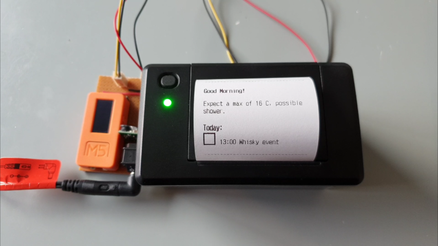

# Agenda

Solving about 1000 problems with TODO lists.



[YouTube video](https://www.youtube.com/watch?v=5Nb2K5nm6Xg)

This project prints out a daily agenda of tasks (and some other bits and
pieces) to keep you focussed on the important stuff.

## Inspiration

This inspiration for this project was twofold. Firstly, [this article in
Wired](https://www.wired.com/story/to-do-apps-failed-productivity-tools/)
really clicked for me - especially the this sentence:

> Every single time you write down a task for yourself, you are deciding how to spend a few crucial moments of the most nonrenewable resource you possess: your life

And the supporting commentary that pure TODO lists often fail because we add
to them without truly considering the impact each item has on our future free
time, so we never really make the time needed to pick off and complete each
one.

The second inspiration for this project was reading Adam Savage's [Every
Tool's a
Hammer](https://www.amazon.com.au/Every-Tools-Hammer-Life-What/dp/1982113472).
His approach to lists and how he indicates task progress by diagonally filling
in a box beside the task blew my mind. I'm a huge fan of physical (on-paper)
lists so this was some wonderful confirmation bias :D

## Philosophy

This is simple. All tasks are entered in my calendar of other events. This
treats them as first-class citizens that have their time accounted for just as
an appointment would. Once a fortnight I look through my calendar and see if
any days are full of tasks (e.g. a couple of reoccurring tasks line up) and I
adjust, but otherwise I don't need to view the month ahead.

## The TODO/task and time management problems this project solved

There are a number of problems this project solved for me (I've been using it
for more than 6 months now):

 - Never remembering to do intermittent important tasks (when did you last remember to check the smoke alarm batteries?!): Tasks like the this and cleaning the AC filters etc are now in my calendar on a reoccurring schedule, and I can forget about them knowing they will just happen.
 - Tracking task progress: This is obvious, but I can fill in the boxes diagonally as a I progress them.
 - Always on a screen: I do like having breaks from screens, and I can do so without losing track of what's planned for a day. Ducking back to the list and filling in a square is a much nicer and lower friction experience than using an app.
 - Planning too many tasks in a single day, so you don't finish them: Fortnightly reviews of my calendar makes this near impossible to achieve.
 - Feeling overwhelmed by a structured future or full calendar: the fortnightly reviews achieve this in two ways. Firstly, I only see a complete overview each fortnight, not each day (although any agenda notification would achieve this). Secondly, if during a review I feel over-scheduled, that's a reflection of my commitments and I need to say no more often. The daily print-out also focusses me on that single day, and I can ignore the rest of the things that might be coming up.
 - Tasks never moving off a "TODO" list because you haven't assigned them a block of your future: With every task being assigned a day (and sometimes even a time) I am explicitly making them part of my future use of time. In reality, that means I commit to less, but actually complete a higher percentage of those commitments, achieving more overall.
 - Tracking dynamic goals (i.e. running 100m further each week): The dynamic tasks service allows you to put simple events in calendar - e.g. "exercise" - and to have them re-written to follow a goal or plan.

## Disclaimer

This is a cut-down version of what I made for myself, but I hope it is a
useful starting point for your project. It's cut down because the Google
Calendar integration is a total nightmare and sharing that in a way that you
could adapt it to your project is near impossible due to the convoluted API
calls, Google Workspace configuration and secrets management. I also can't
build this to suit everyone's weather data sources, so I've mocked that out
too.

## Installing it

### Python Flask web app

Development:

```bash
pipenv install --dev
```

Production:

```bash
pipenv install
```

### ESP-32 Program

 - Set the appropriate settings in `esp32app/agenda/settings.h`
 - Install to ESP-32 via Arduino IDE

## Running it

### Python Flask web app

Development:

```bash
pipenv run python webapp\test_server.py --reload
```

Production:

```bash
cd webapp
pipenv run waitress-serve agenda:app
```

Tests:

```bash
pipenv run python -m pytest
```

## How it works

The web app generates very simple HTML on the root (`/`) path. This route is
good for testing locally.

The print path (`/print`) reads that simple HTML, and replaces tags with
printer-specific escape commands (using an HTML event parser):

  - `<li>` to a square BMP
  - `<strong>` to start bold text
  - `</strong>` to end bold text
  - `<h1>` to start double-size text
  - `</h1>` to end double-size text
  - `<br />` to newline

Using a scheduled power point controller, the ESP-32 simply loads the print
path at 6am, sending it straight to the printer.

## Issues

  - The box for task progress isn't aligned well. You cannot print below the baseline and when I make it the size of the font it looks too small. If I fix it in my version I'll update this repo to match.

## Hardware

I'm using:

 - M5StickC ESP-32 Microcontroller
 - EM5820 Thermal Printer (same as in [this project](https://shop.m5stack.com/products/atom-thermal-printer-kit?variant=42135643095297))
 - Custom power distribution and communications board

## Hat-tips

 - https://forums.adafruit.com/viewtopic.php?f=19&t=32217
 - https://github.com/m5stack/ATOM-PRINTER
 - https://github.com/python-escpos/python-escpos/blob/master/src/escpos/constants.py
 - https://github.com/wakwak-koba/LGFX_PrinterAddon/blob/master/src/printer/aiebcy/EM5820.hpp
